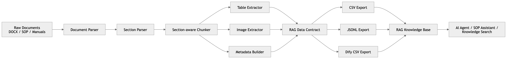
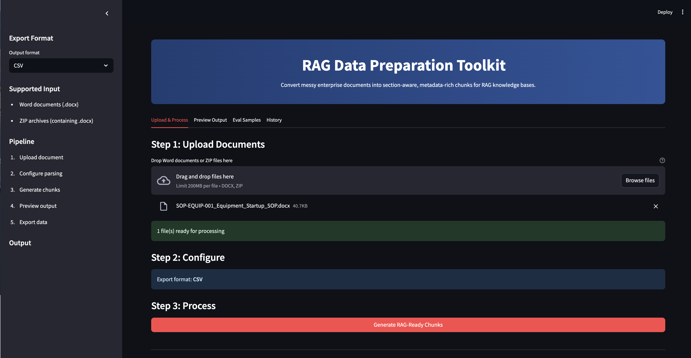
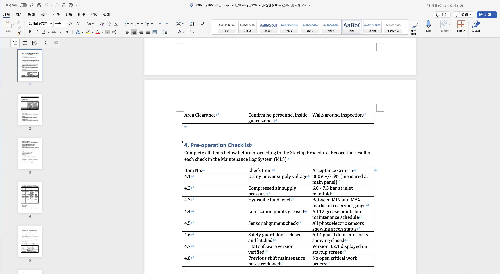
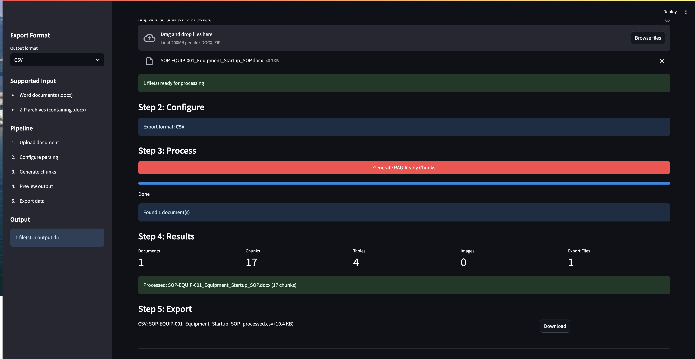
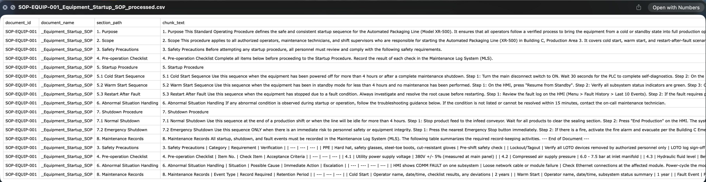

# RAG Data Preparation Toolkit

A document preprocessing pipeline for building RAG-ready knowledge bases.

## Why This Project Exists

Most RAG applications fail not because of the model, but because of the data. Source documents are messy, poorly chunked, and lack the metadata that retrieval systems need. Enterprise documents — SOPs, work instructions, maintenance guides, policy manuals — are written for humans, not for vector databases. They contain nested tables, inline images, multi-level headings, and inconsistent formatting that generic text splitters cannot handle.

This toolkit solves the upstream problem: turning unstructured business and industrial documents into structured, section-aware, metadata-rich chunks that RAG systems can actually use.

## What It Does

The toolkit converts unstructured business and industrial documents into structured chunks with:

- **Section paths** — full heading hierarchy preserved (e.g. "3. Safety > 3.1 PPE Requirements")
- **Clean text chunks** — content split at section boundaries, not arbitrary token limits
- **Table content** — Word tables converted to Markdown, attributed to the correct section
- **Image references** — inline and table images extracted with caption association
- **Metadata** — document ID, document name, source file, chunk type
- **Exportable files** — CSV for direct ingestion into knowledge base systems

## Current Implemented Scope

The current version focuses on **DOCX documents**, especially **SOPs and work instructions**. This is the first use case — the architecture supports adding more document types later.

## Pipeline



Raw documents go through section-aware parsing, text/table/image extraction, metadata tagging, and export — producing structured chunks ready for any RAG knowledge base.

## Features

### Implemented

- DOCX document parsing
- Section-aware heading detection (Word styles, numeric numbering, keyword matching)
- Section-aware chunk generation (content split at heading boundaries)
- Table extraction (Word tables converted to Markdown)
- Image extraction with caption matching (inline and table-embedded)
- Batch processing (folder of .docx files)
- Streamlit upload UI (drag-and-drop, ZIP support, progress tracking)
- CSV export (4-column: document_id, document_name, section_path, chunk_text)
- JSONL export (text + metadata per line)
- Dify-compatible CSV export

### Roadmap

- PDF input support
- HTML / Markdown input support
- LangChain Document loader output format
- LlamaIndex Document loader output format
- Chunk size and overlap configuration
- Deduplication across chunks
- Retrieval quality dashboard
- REST API endpoint
- Docker deployment

## Use Cases

- **Industrial SOP knowledge base** — convert factory SOPs into searchable chunks for operator assistance
- **Maintenance guide assistant** — power a chatbot that answers equipment maintenance questions
- **Internal policy knowledge base** — make HR/policy documents queryable by employees
- **Training material search** — enable new hires to search training documents by topic
- **AI agent knowledge preparation** — prepare structured context for autonomous agents
- **AI PM RAG prototype preparation** — quickly build a working RAG demo from real documents

## Quick Start

```bash
# Install dependencies
pip install -r requirements.txt

# Launch Streamlit UI
streamlit run app/streamlit_app.py

# Process a single document via CLI
python scripts/process_single.py examples/sample_sop.docx

# Batch process a folder
python scripts/process_batch.py path/to/documents/ --format csv
```

## Screenshots

### Streamlit App — Main Page



The Streamlit interface provides a step-by-step workflow: upload documents, configure export format, process, preview, and download. All processing runs locally — no data leaves your machine.

### Document Input



Upload one or more `.docx` files, or a ZIP archive containing multiple documents. The toolkit detects Word documents automatically and validates file size before processing.

### Processing



During processing, the pipeline extracts headings, tables, and images from each document. A progress bar shows real-time status. Summary metrics (documents processed, chunks generated, tables extracted) update as each file completes.

### Structured Output



After processing, each chunk carries its full section path, chunk type (text/table/image), and metadata. Tables are converted to Markdown. The preview tab lets you filter by document, section, or chunk type before exporting.

## Output Schema

Each chunk produced by the pipeline contains:

| Field | Type | Description |
|-------|------|-------------|
| `document_id` | string | Document identifier extracted from filename |
| `document_name` | string | Document name extracted from filename |
| `section_path` | string | Full heading hierarchy (e.g. "3. Safety > 3.1 PPE Requirements") |
| `chunk_text` | string | Content: text, Markdown tables, and image references |
| `chunk_type` | string | "text", "table", or "image" |
| `source_file` | string | Original filename |
| `image_refs` | string | Referenced image filenames (if any) |
| `table_refs` | string | Referenced table content (if any) |

See [docs/rag-data-contract.md](docs/rag-data-contract.md) for the full data contract.

## AI PM Portfolio Notes

This project demonstrates:

- **RAG data readiness thinking** — understanding that retrieval quality depends on data quality, not just the embedding model
- **Enterprise document understanding** — handling real-world complexity: nested tables, inconsistent heading styles, inline images, multi-language content
- **Productized data pipeline design** — not a notebook script; a modular, testable toolkit with CLI, UI, and export formats
- **Metadata-first knowledge base design** — section paths and chunk types enable filtered retrieval, not just flat similarity search
- **No-code tool design for business users** — Streamlit UI lets non-technical users upload documents and download structured output without touching code

## Project Structure

```
RAG-Data-Preparation-Toolkit/
├── app/
│   └── streamlit_app.py              # Streamlit web UI
├── rag_data_toolkit/
│   ├── __init__.py
│   ├── document_loader.py            # File validation and .docx loading
│   ├── docx_parser.py                # Block iteration, paragraph section maps
│   ├── section_parser.py             # Heading detection (3-tier priority)
│   ├── chunker.py                    # Main orchestrator — chunk generation
│   ├── table_extractor.py            # Word table to Markdown, section attribution
│   ├── image_extractor.py            # Image extraction with caption matching
│   ├── metadata_builder.py           # document_id / document_name from filename
│   ├── eval_generator.py             # Synthetic QA samples for RAG evaluation
│   └── exporters.py                  # CSV, JSONL, Dify export
├── scripts/
│   ├── process_single.py             # CLI: single document
│   └── process_batch.py              # CLI: batch folder
├── examples/
│   ├── README.md                     # Demo workflow and output explanations
│   ├── sample_output.csv             # Example CSV output
│   ├── sample_output.jsonl           # Example JSONL output
│   ├── sample_dify_export.csv        # Example Dify-compatible export
│   └── sample_eval_samples.csv       # Example eval samples
├── test_sops/
│   └── SOP-EQUIP-001_Equipment_Startup_SOP.docx  # Synthetic test document
├── docs/
│   ├── assets/
│   │   ├── mermaid-diagram.png       # Pipeline diagram
│   │   └── screenshot_*.png          # UI screenshots
│   ├── product-brief.md
│   ├── architecture.md
│   ├── rag-data-contract.md
│   ├── roadmap.md
│   └── ai-pm-portfolio-notes.md
├── tests/
│   └── test_pipeline_smoke.py
├── README.md
├── CLAUDE.md
├── requirements.txt
└── LICENSE
```

## Requirements

- Python 3.9+
- python-docx, pandas, streamlit

## Security

- All processing is local — no data leaves your machine
- No real company documents are included in this repository
- `.gitignore` blocks `.docx`, images, and output files
